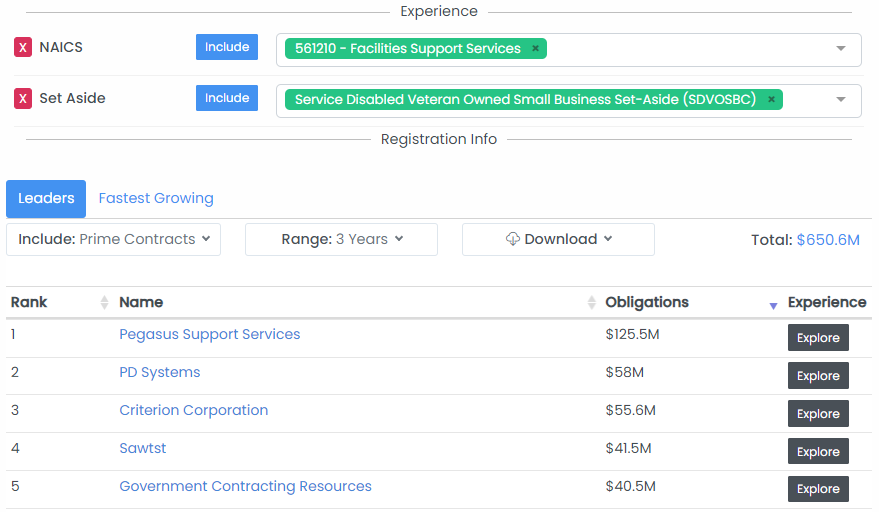

# Find And Analyze Competing Bidders

## Identifying Potential Bidders

Identifying potential competing bidders for a contract or grant opportunity can help you competitively position your proposal, understand how strong competition is likely to be, and can assist in teaming efforts.

### In Contract Opportunities

Most Contract Opportunity pages will show an automatically generated list of potential competing bidders based on the agency, PSC, set-aside, and other details of the contract opportunity.  To find a contract opportunity enter the title or solicitation ID in the search bar at the top of each page or search for the Contract Opportunity in the [Contract Opportunity search](https://www.highergov.com/contract-opportunity/).  If a contract opportunity has not been publicly disclosed, see below for two other methods to identify potential bidders.

Note that for historical contract opportunities, HigherGov lists potential competing bidders as if the contract opportunity was being competed today. This can be helpful in identifying contractors that may have bid on an opportunity and not won or identifying who would potentially bid if a historical opportunity is reopened or recompeted in the future. &#x20;

### In Pursuits

If you use the [HigherGov CRM](https://www.highergov.com/capture-tools/), each saved Pursuit will have a list of the potential bidders listed on the Bidders tab.  The accuracy of the bidders shown here is dependent on how fully data has been completed for the pursuit (for example, Agency, Set Aside NAICS codes, and Title / Description).

### Partner Finder Tool

HigherGov's [Partner Finder](https://www.highergov.com/partner-finder/) tool provides a powerful set of tools to find contractors or grant recipients most likely to win opportunities based on prior experience or certifications.  See the link below on how to use the Partner Finder tool.


[find-teaming-partners.md](find-teaming-partners.md)


<figure><figcaption></figcaption></figure>

If the opportunity is a contract being competed under a Master IDIQ or BPA vehicle, we recommend looking at the relevant [vehicle](https://www.highergov.com/vehicle/) page and analyzing the awardees and vehicle share of that vehicle specifically.&#x20;

## Analyzing Potential Bidders

### Awardee Profile

Once you have identified a potential bidder, you can learn more about their prior experience, contract vehicle access, partners, and other details relevant to their competitive positioning by reviewing their Awardee page.  For more information see the below guide:


[research-federal-contractors-and-grant-recipients.md](../market-intelligence/research-federal-contractors-and-grant-recipients.md)


### Offerings and Pricing

If the Awardee has a GSA Schedule such as a Multiple Award Schedule, the schedule can provide more context about what services and products the contractor provides beyond what you can typically find on their website and also can assist in understanding how they price their services and products.&#x20;

You can also find an Awardee's GSA schedule on the [Awardee](https://www.highergov.com/awardee/) page.  Alternatively, you can also search for schedules by going to the [Document](https://www.highergov.com/document/) search page, selecting the **Source** filter and choosing Federal Schedule, and then typing in the awardee name as a **Keyword**. &#x20;

Many contractors will also have pricing available in the [Labor Pricing](https://www.highergov.com/labor-pricing/) tool.  &#x20;

## Related Pages


[federal-prime-contracts.md](../find-opportunities/federal-prime-contracts.md)


