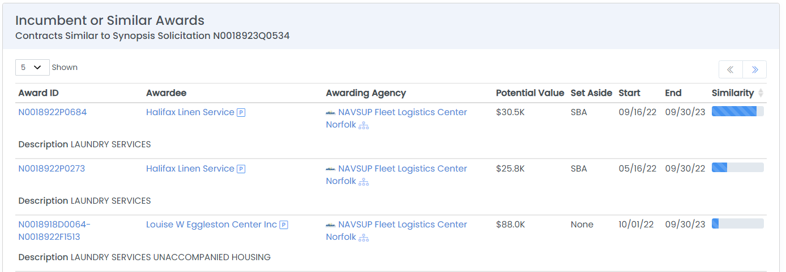

# Find Federal Incumbents

Identifying the incumbent for a recompeting contract can help in making a bid go/no-go decision, pricing the bid, finding partners, and positioning the proposal.

### Federal Contract Opportunities

HigherGov will automatically search for incumbent and similar awards for new contract opportunities.  This analysis is available in the "Incumbents" section on the Federal Contract Opportunity page.  To identify incumbent and similar contracts, HigherGov looks at key contract information including keywords and contract structure and measures the similarity.&#x20;

Hover over the Similarity bar to see the matching features of the existing contract.  Click on the Award ID to learn more information about the contract. &#x20;

<figure><figcaption></figcaption></figure>

.png>)

#### Searching Manually

Incumbent contracts and grants can also be searched for manually using the [Contract](https://www.highergov.com/contract/) or [Grant](https://www.highergov.com/grant/) Award search.  Typical filters to use include:

* **Date Potential End**: Set with a range around the expected award date for the opportunity.
* **Agency (Awarding)**: The agency that issued the opportunity.  We recommend initially setting the agency broadly (e.g., FEMA instead of FEMA Region 6), as sometimes the awarding agency will shift between iterations of a contract, even if the work remains the same due to reorganizations.
* **Place of Performance:** Where the contract is to be performed if a service contract.  We recommend setting this broadly at the Country or State level.
* **Keywords**: Adding a couple of keywords can help to limit the results if the prior filters are returning too many results.
* **NAICS**: The NAICS of the opportunity.  Note that NAICS codes often change between contract iterations so it may make sense to add multiple NAICS in the search or to leave off entirely.
* **Vehicle**: Can be used if the new opportunity is being issued under a specific contract vehicle.

In some cases, it may make sense to also use **PSC** code or **Potential Value** as filters if there are too many results with the above filters.  Please see an example search using Date Potential End, Agency (Awarding), Place of Performance, and keywords [here](https://www.highergov.com/contract/?searchID=7Bpvih7aTWUMZ9sypkB8r#contract).

<figure><figcaption></figcaption></figure>
