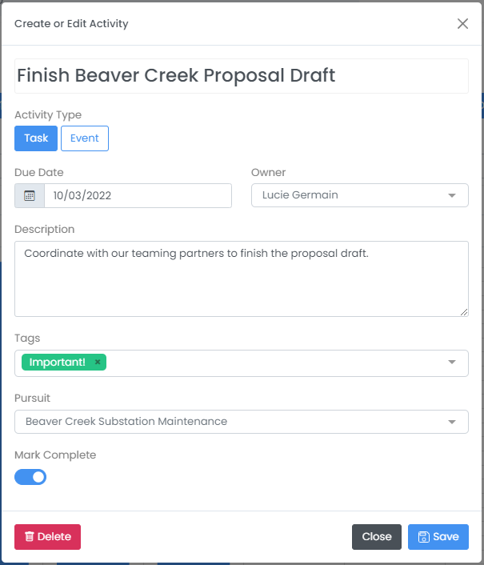

# Track Pursuits, Collaborate, and Manage Pipelines


HigherGov offers a fully integrated CRM designed for government contracting and grants.  The CRM integrates the best practices of leading capture professionals and can be set up in minutes.  If you are not currently a subscriber you can try out the CRM by [signing up](https://www.highergov.com/signup/) for a trail account or scheduling a [demo](https://www.highergov.com/demo/).&#x20;


## Creating a Pipeline

The first step in managing pursuits on HigherGov is to create a Pipeline.  You can create a pipeline by selecting _Business Development --> Pipelines --> \[+]_ on the sidebar.  On this page, you can enter a Title, Description, set a Pipeline Owner, enter the Types of Contracts you will pursue and set preset or custom Pipeline Stages.

For the Pipeline Stages, you can select one of four available presets, or press the Customize Stage button on any of the presets to customize the number and name of stages as well as set custom p(win) and p(go) options.  If you set a customized p(win) or p(go), these values will automatically populate in the pursuit when you change the stage.  This can be helpful in encouraging weighting standardization across your pipeline.

If you are an annual subscriber and transitioning from another CRM or tracking method, please [contact us](mailto:contact@highergov.com) or message us in the chat and we can help bulk migrate your Pursuits into HigherGov.

## Finding and Adding Pursuits

### Find Opportunities

HigherGov has many tools to help to identify potential opportunities to pursue.  See one of the below topics for more details on some of the available tools.


[find-federal-prime-contract-opportunities.md](../find-opportunities/find-federal-prime-contract-opportunities.md)



[find-federal-subcontract-opportunities.md](../find-opportunities/find-federal-subcontract-opportunities.md)



[find-federal-grant-and-subgrant-opportunities.md](../find-opportunities/find-federal-grant-and-subgrant-opportunities.md)


### Adding Automatically

You can automatically create new pursuits from Contract Opportunity, Pre-RFP Opportunity, Grant Opportunity, SBIR, IDV Award, Prime Contract Award, and Prime Grant Award pages by selecting the Pipeline dropdown on the upper right of the page and selecting the pipeline you want to add the opportunity to.  This will create a new opportunity and autofill any available information from the opportunity or contract.

Once you have created a pursuit automatically you can further edit the pursuit by going to _Business Development --> Pursuits_ and selecting the pursuit you created.

### Adding Manually

You can manually create a new pursuit by selecting _Business Development --> Pursuits --> \[+]_ on the sidebar.  From here you can enter basic pursuit information, add links to other relevant data in HigherGov, upload documents, talk with your team members, and create activities for yourself and others.

Once you have added some information about the Pursuit and saved, the Bidders and Similar tabs will populate, providing you additional insights about potential bidders as well as similar active opportunities. The more completely the pursuit information is completed, the more accurate and useful the insights these tabs provide will be.

## Managing Pursuits

### Editing Pursuit Details

Once you have created a pursuit, you can edit it by opening it from the Pursuit search page or Search All page, making any changes, and saving. &#x20;

Alternatively, you can also filter and edit key pursuit information in bulk by selecting _Business Development --> Pipelines_ in the sidebar and clicking on the Pursuit tab.  On this tab, you can filter the displayed information by **Pipeline** or **Owner** by using the dropdowns at top and further filter by **Stage** as well as pursuits **Past Due**, **Due Soon**, and **Stale** (not updated recently).  Key pursuit information including Proposal Date, Pursuit Stage, p(win), p(go), and Estimated Value can be quickly updated from this page or you can open the pursuit to edit other information.

### Managing Activities

You can further manage pursuits by adding Activities, including activities and events, for yourself and others. You can create a new Activity by selecting _Business Development --> Activities --> \[+]_ from the sidebar anywhere in HigherGov or within a pursuit by going to the Activities tab and selecting the \[+New] button.&#x20;

For each activity, you can add a Title, Activity Type, Due Date, Owner, Description, Tags, and assign the Activity to any Pursuit.  You can view all of your team's activities by going to activity search under _Business Development --> Activities_ in the sidebar or reviewing the calendars on your Dashboard or on the Pipeline Review page.  From these pages you can also edit Activities at any time.

## Tracking Your Pipeline

You can track your pipelines by selecting _Business Development --> Pipelines_ from the sidebar and further filtering for specific Pipelines or by Owner using the bar at the top of the page.&#x20;

### Analysis

The analysis tab shows the key overview statistics of the selected Pipelines / Owners and allows you to further analyze the Current Weighted and Unweighted Pipeline, Projections, Composition, and Win/Loss ratios.

### Calendar

The Calendar tab shows all historical and upcoming pursuits and activities for the selected Pipelines / Owners.  This calendar is also available from your Dashboard when you sign in.

### Bulk Pursuit Editor

Need to make adjustments quickly?  The Pursuits tab in the Pipeline Review allows for rapidly changing proposal due date, pursuit stage, p(win), p(go), and estimated value for multiple pursuits quickly.  The Pipeline Analysis will be automatically updated after adjustments are made.

