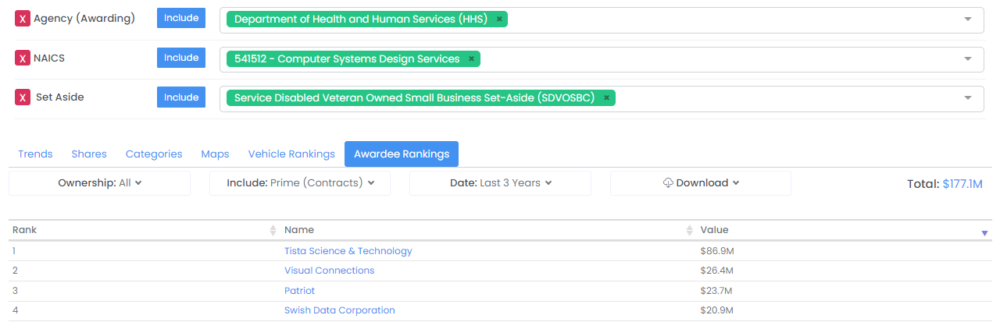
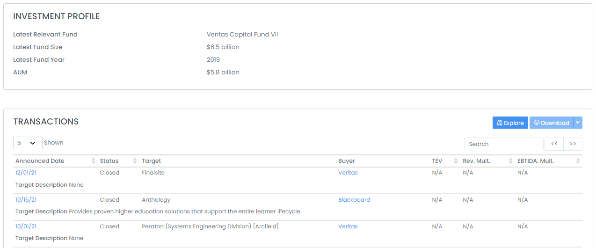
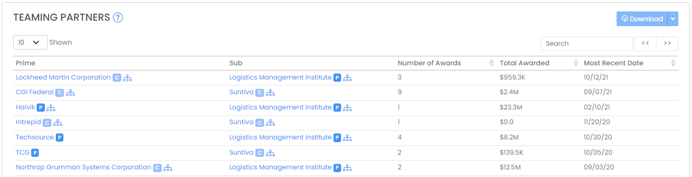
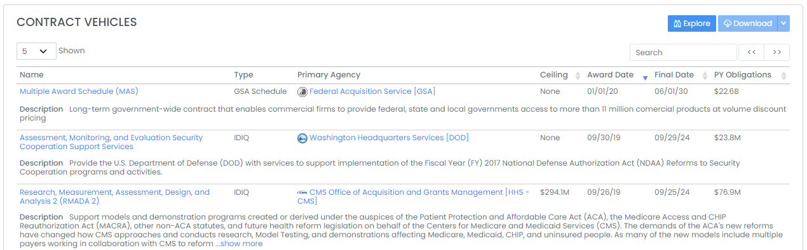

# Find M\&A Targets and Buyers


Please note that to access some of the tools listed below, you must have a HigherGov [Leader](https://www.highergov.com/pricing/) subscription.  If you are interested in learning more, please schedule a [demo](https://www.highergov.com/demo/).


## **Awardee Rankings** Tool

The Awardee Rankings tool allows you to find the awardees most active in certain categories of awards, which can be used to identify buyers or targets that are leaders in products/services categories, agencies, socio-economic types, etc.  The Awardee Rankings tool is available by going to _Explore --> Analysis_ in the sidebar and by selecting the Awardee Rankings tab.   &#x20;

Recommended filters to add include here are (but are not limited to):

* **Agency (Awarding)**
* **NAICS** or **PSC**
* **Set Aside** (select **No Set Aside Used** for Full & Open competition)&#x20;

You will also likely want to limit the search to include only **Prime + Sub (Contracts)** under the Include dropdown (unless you also want to include Grant recipients).  You may want to set the search to include the **Last 3 Years** under the Date dropdown to incorporate a wider data timeframe. &#x20;


Please note that the Awardee Ranking Tool only shows Parent awardees, so subsidiaries and acquired companies will typically not be included in the ranking. &#x20;


## **Awardee Search**

You can also filter for potential buyers or targets that meet desired criteria by going to _Market Intelligence --> Awardees_ in the sidebar or clicking [here](https://www.highergov.com/awardee/).  Some of the common criteria for filtering for buyers or targets include:

* **NAICS**: Limit the search to contractors focused on the most relevant NAICS codes&#x20;
* **Business Type**: Limit the search to contractors with the most relevant business types (with For-Profit Ownership being the most common)
* **Contract PY Obligations**: Limit the search to awardees with at least a certain level of prior year federal contract obligations (includes both prime and subcontracts)


Note that the NAICS and Business Type filters are based on the NAICS codes and Business Types disclosed in the awardee's registration with the federal government and does not necessarily reflect their historical performance.  For filtering based on actual historical performance, see the Awardee Ranking tool above.


## **Investors**&#x20;

There are many active investors in the Aerospace, Defense, and Government sector.  HigherGov actively tracks over 150 investors that focus on the sector or have a history of investing in the sector.  Investors can be filtered on the Investor search page under _Capital Markets --> Investors_ in the sidebar. &#x20;

Another method for finding relevant investors is by searching for transactions with similar characteristics on the M\&A Transactions search page at _Capital Markets --> M\&A Transactions_ in the sidebar and looking at the investors involved in those transactions. &#x20;

To further analyze an investor, you can go to their Investor detail page to find additional detail such as fund size, minimum and maximum investment size, select historical transactions, as well as contact information.

## **Partners and Vehicles**

Two other common methods for finding potential targets or buyers is to look at the teaming partners or fellow contract vehicle holders of an existing known target / potential buyer.

* **Teaming Partners**: Teaming partners can be found on the Awardee detail page (if the Awardee has disclosed partners).

* **Vehicles**: A list of Vehicles held by an Awardee can be found on the Awardee detail page, with the other vehicle holders on the Vehicle detail page (you can also search for vehicles [here](https://www.highergov.com/vehicle/)).  You can also filter for Awardees by Contract Vehicle by using the Vehicle filter on the [Awardee search page](https://www.highergov.com/awardee/).&#x20;

## Related Pages


[research-federal-contractors-and-grant-recipients.md](../market-intelligence/research-federal-contractors-and-grant-recipients.md)



[analyze-m-and-a-transactions-and-trends.md](analyze-m-and-a-transactions-and-trends.md)

