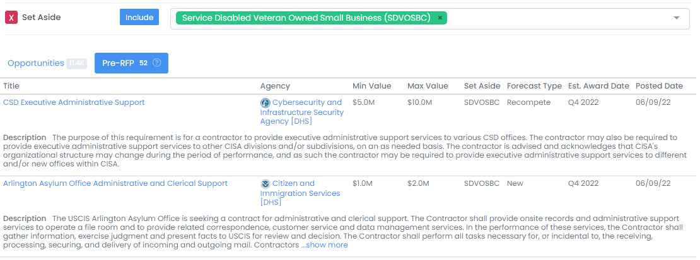
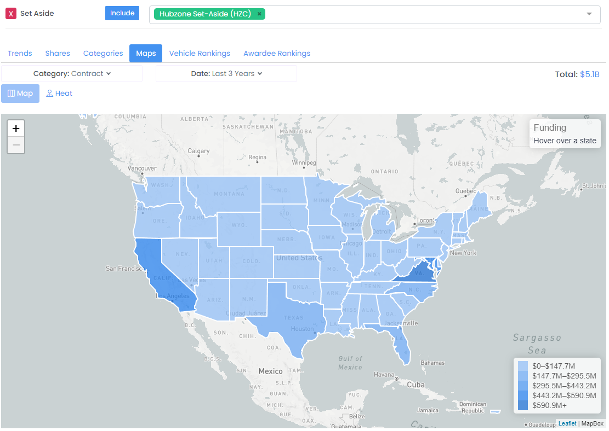

# Federal Small Business Contracts


This guide is focused on tips for finding set-aside contract opportunities.  To learn more generally how to search for prime contract opportunities including how to save searches, receive daily recommendations, and more, please see the below guide.



[federal-prime-contracts.md](federal-prime-contracts.md)


## Contract Opportunity Search

### Issued Solicitations

The most direct way to search for contract opportunities is on the Contract Opportunity Search page, which can be found under _Business Development --> Opportunities --> Contracts_ in the sidebar or by clicking [here](https://www.highergov.com/contract-opportunity/).

To filter for set-aside opportunities you can either select **Has Set Aside** under the Quick search or select the **Set Aside** under Search All and then select the specific categories relevant to your business.

You can further filter contract opportunities by a number of criteria to narrow opportunities to those that are most relevant to your business including **Agency**, **NAICS**, **PSC**, and **Place of Performance, Active Opportunities**, and **Future Vehicles**. &#x20;

As you find potentially interesting contract opportunities, you can click the opportunity title to open up the Contract Opportunity detail page to see the opportunity description, history, related solicitations, documents, similar opportunities, potential bidders, and other detail.  You can also follow the opportunity by clicking the heart button to easily access it later.&#x20;


Not sure if you qualify as a small business for a particular contract opportunity?  You can check the SBA small-business threshold for a particular NAICS code by searching for the NAICS code in the search bar at the top of the page and reviewing the SBA Size Standard (if there is one).&#x20;


### Forecasted Opportunities

Many federal agencies will notify the contracting community of their intent to issue new or recompete contract set-aside opportunities before releasing the solicitation.  These future opportunities that are tracked by HigherGov and can be found on the Forecasts tab of the Contract Opportunities Search page.  These Forecasted opportunities can be filtered using the same criteria as regular contract opportunities.

### SBIR / STTRs


Small Business Innovation Research (SBIR) and Small Business Technology Transfer (STTR) programs encourage domestic small businesses to engage in Federal Research/Research and Development (R/R\&D) with the potential for commercialization.


SBIR and STTR opportunities are available on the Grants Opportunities page by going to _Opportunities --> Grants_ in the sidebar.  SBIR/STTRs can be structured either as contracts or grants depending on the agency.

SBIR / STTRs are broken into three phases:&#x20;

* **Phase I**: Applicants submit a proposal outlining their proposed project which is evaluated by the sponsoring agency. If selected, applicants receive up to $250 thousand in funding to develop a prototype or proof-of-concept.
* **Phase II**: Successful applicants from Phase I can receive up to $1 million in funding to further refine the prototype or concept with an emphasis on marketability and commercialization potential.
* **Phase III:** Awardees are encouraged to seek private sector investment or venture capital funding as they transition their product into the marketplace.  In some cases, Phase III can include non-SBIR contracts from the government for continued development or for production.  These contracts can range into the tens of millions of dollars.


You can learn more about the long-term trends and benefits of SBIR awards in our [annual report](https://www.highergov.com/news/sbir-awards-reach-record-high-2023/).


## Potential Set-Aside Recompetes

### Searching for Potential Recompetes

An effective way to find upcoming contract opportunities is to find relevant contracts that may recompete before they become publicly available as solicitations (if they do ever become publicly available).  You can search for potential IDV and Prime Contract recompetes from the Contract search page at _Market Intelligence --> Awards --> Contracts_ in the sidebar or by clicking [here](https://www.govalpha.com/contract/). &#x20;

Here you can search for relevant potential recompetes by selecting the **Potential Recompete** option under Filters and then adding either the **Has Set Aside** filter under the Quick search or select **Set Aside** under Search All and then select the specific categories relevant to your business.  You can further add additional filters to customize your search (for example, **NAICS**, **PSC**, **Agency**, etc.). &#x20;

### 8(a) Graduations (Vulnerable 8(a))

If you participate in the 8(a) program, an additional available tool to find recompetes is to search for contracts currently held by 8(a) program members who will soon be graduating and thus are more likely to be awarded to a new contractor upon recompete.  You can filter for these contracts on the [Contracts](https://www.highergov.com/contract/) search page by selecting the **Vulnerable 8(a)** quick filter.  You can combine this filter with other relevant additional filters to narrow down to the potential recompetes most relevant to you.

.png>)

### Small Business Graduations (Vulnerable Small Business)

You can also search for potential recompetes for competitors or other awardees that may have a limited ability to recompete for a contract because they have exceeded the NAICS set aside threshold for the contract, either through growth or through acquisition.  You can filter for these contracts on the [Contracts](https://www.highergov.com/contract/) search page by selecting the **Vulnerable Small Business** quick filter.  You can combine this filter with other relevant additional filters to narrow down to the potential recompetes most relevant to you.

## **Researching Entrance Points**

### Analysis Tools

You can use the HigherGov Analysis tool to research trends in small-business contracting at different agencies or products and services.  Access the reporting tool by going to _Explore --> Reports_ in the sidebar.  From here, you can use the **Set Aside** filter to set the types of set-asides you would like to analyze.  You can combine this with other filters such as **NAICS**, **PSC**, or **Agency (Awarding)** to further refine your analysis.

You can use the **Trends** tab to look at trends in set-aside obligations, the **Shares** tab to analyze different categories contribution to the total, the **Categories** tab to see how major categories of set-aside awards have changes over time, the **Maps** tab to see the distribution of set-aside awards, the **Vehicles Ranking** tab to find key set-aside vehicles, and the **Awardees Rankings** tab to see the largest set-aside contractors.

### **Set-Aside Goals**

Federal agencies have different targets for the level of funding set aside for small business contracts. The table below shows small business set-aside targets by federal agency for Government Fiscal Year 2022. Additional analysis to help find the best market areas of opportunity for set-aside contracts (including by NAICS/PSC code and by Agency) based on historical trends is available for annual subscribers by selecting Analysis in the sidebar and clicking Custom.


