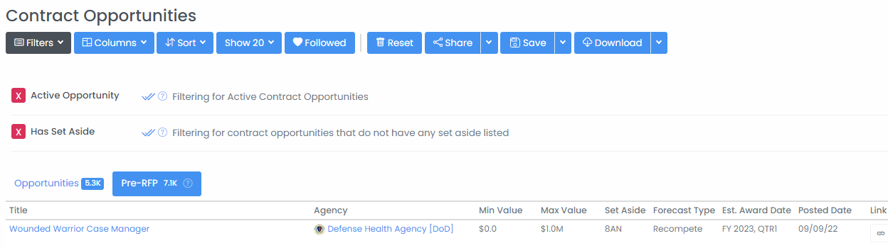

# Find Federal Opportunities Before RFP Release

## Importance of Finding Opportunities First

Once an opportunity is posted to sam.gov or grants.gov there has often been a significant amount of preparation and shaping done by incumbent awardees or contractors/grantees with a close relationship with the soliciting agency.  In some cases, opportunities are never formally posted at all as they are directed to specific contract vehicles or limited groups of potential bidders.

Identifying opportunities earlier allows you to prepare and position for the eventual solicitation, potentially shape the RFP, and forecast appropriately.  HigherGov offers multiple tools to find opportunities before they become widely known to the market.

## Contract Opportunities

### Forecasted Opportunities

Opportunities that are forecasted by agencies prior to their formal release can be found going to _Opportunities --> Contracts_ in the sidebar and selecting the Forecasts tab or by clicking [here](https://www.highergov.com/contract-opportunity/#contract\_forecast).  Forecasted opportunities can be filtered using most of the same filter criteria that apply to released contract opportunities (such as **NAICS** or **Set-Aside**) by selecting the Filters dropdown.  By clicking on the Title, you can go to the Contract Forecast detail page, which includes details including expected award dates, categories, incumbents, and contact information (as available).

<figure><figcaption></figcaption></figure>


Note that many agencies do not reliably provide contract forecasts, provide forecasts at highly irregular intervals (e.g., once every few years), or provide forecasts of extremely low quality.  HigherGov incorporates contract forecasts for as many agencies as possible and attempts to standardize and enhance the available data.  If you are an annual subscriber and would like data on an agency we do not currently cover, please contact us in the chat to discuss availability. &#x20;


### Sources Sought

Opportunities that have been formally posted to sam.gov but are not yet at the stage of formal solicitation can be found by going to _Opportunities --> Contracts_ in the sidebar or by clicking [here](https://www.highergov.com/contract-opportunity/), selecting **Opportunity Type** from the list of Filters, and selecting Presolicitation and Sources Sought.  If you are only looking for active opportunities, you should also select the **Active Opportunity** filter.  You can add your own filters such as **Agency**, **NAICS**, **Set Aside** or other filters to further focus on the most relevant contracts for your business.

<figure><figcaption></figcaption></figure>

### Recompetes

Existing IDV and Prime contracts that are likely to recompete in the near term can be found by going to _Awards --> Contracts_ in the sidebar (or by clicking [here](https://www.highergov.com/contract/)) and selecting **Recompete Opportunities** under Quick search.  This filters for contracts that based on duration, value, and other factors are likely to recompete within the next 9 months.  You can add your own filters such as **Agency**, **NAICS**, **Set Aside** or other filters to further focus on the most relevant contracts for your business.

By clicking the Award ID, you can learn more about the existing contract, including the description and categorizations, awarding/funding agency, incumbent, timing, and more.

<figure><figcaption></figcaption></figure>

### Vulnerable Incumbents

You can further limit your search for recompetes to target by looking for contracts where the incumbent contractor may not be able to recompete for the contract.  As incumbents typically win recompetes 50-75% of the time, identifying and focusing on recompete opportunities where the incumbent may no longer be eligible for the contract, can greatly increase the likelihood of winning.

There are two Quick filters available to search for vulnerable incumbents on the Contract Award page: **Vulnerable 8(a)**: Contracts where the awardee has or will soon graduate from the 8(a) program

* **Vulnerable Small Business**: Contracts where the awardee has potentially exceeded the NAICS size standard (either due to growth or acquisition)

<figure><figcaption></figcaption></figure>

## Grant Opportunities

### Forecasted Opportunities

Agencies that award grants will frequently provide forecasts of grant opportunities in advance of a formal posting.  To find forecasted grant opportunities, go to _Opportunities --> Grants_ in the sidebar (or click [here](https://www.highergov.com/grant-opportunity/)) and select **Posting Type** from the list of filters and choose the Forecasted checkmark. &#x20;

### Recompetes

To find grants that are likely to be re-awarded, go to _Awards --> Grants_ in the sidebar (or click [here](https://www.highergov.com/grant/)) and select **Recompete Opportunities** under Quick Search.  This filters for grants that based on duration, value, and other factors are likely to recompete within the next 9 months.  You can add your own filters such as **Agency**, **Assistance Type**, or **Place of Performance** or other filters to further focus on the most relevant contracts for your business.

<figure><figcaption></figcaption></figure>

## Related Pages


[find-contracting-and-grant-entry-points.md](../market-intelligence/find-contracting-and-grant-entry-points.md)


