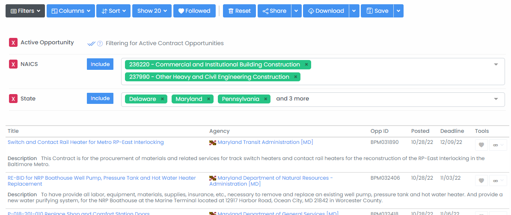
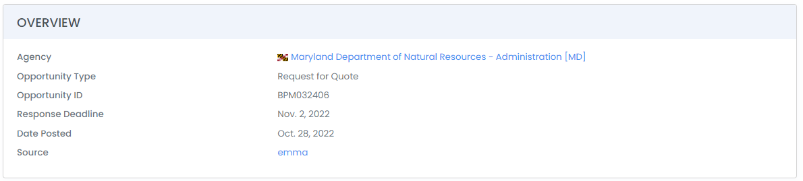

# Find State and Local Contract Opportunities

## Contract Opportunity Search

### Creating Filters

To search for state, local, and education contract opportunities, go to _Business Development --> Opportunities --> Contracts_ in the SLED sidebar or click [here](https://www.highergov.com/sl/contract-opportunity/) (must be signed in).  On this page you can add filters to narrow opportunities to those that are most relevant to your business. &#x20;

Common search filters include:

* **Active Opportunities**: Limit the search to contract opportunities with a deadline in the future&#x20;
* **Agency**: Search for contract opportunities within a specific agency
* **Agency Type**: Limit the search to opportunities released by a certain category of agency such as Fire or Police Departments or Public Utilities
* **Keyword:** Search the opportunity titles and descriptions for specific keywords
* **NAICS**: Limit results to contracts that are classified under a particular North American Industry Classification System code
* **PSC**: Limit results to contracts that are classified under a particular Product Services Code
* **State**: Limit results to where the issuing agency is within a specific state or region

<figure><figcaption></figcaption></figure>

### Saving Searches

On the Contract Opportunity Search page (as well as all other Search pages on HigherGov), you can press the Save button to save your search to easily access later.  When saving a Search you can also opt-in to receive an email notification when there have been new results for the search.  You can access your saved searches at any time by selecting the dropdown arrow next to the Save button or by going to to _Tools --> Saved Searches_ in the sidebar.

### Daily Recommendations

You can also opt-in to receive a daily email of recommended contract opportunities by singing in and selecting the gear icon in the upper right, going to Profile, and switching on **Daily SLED Opportunities Email**.  For annual subscribers, this email will be customized to the most relevant opportunities based on the contractor they work for.


HigherGov covers 7,000+ SLED agencies representing the vast majority of spending.  To request additional agencies, please email us or contact us in the chat. &#x20;


## Finding Additional Information and Applying

By selecting a contract opportunity, you can see the opportunity description as well as key details including the posting and due date and other relevant information.  Most contract opportunities will have a direct link to the source where you can learn additional information about the contract opportunity and details on how to apply.  In some cases, the opportunity source may not have a linkable page, and it may be necessary to search for the contract opportunity ID or title at the source to see additional details.

<figure><figcaption></figcaption></figure>


[track-pursuits-collaborate-and-manage-pipelines.md](../business-development/track-pursuits-collaborate-and-manage-pipelines.md)



[find-federal-prime-contract-opportunities.md](find-federal-prime-contract-opportunities.md)

