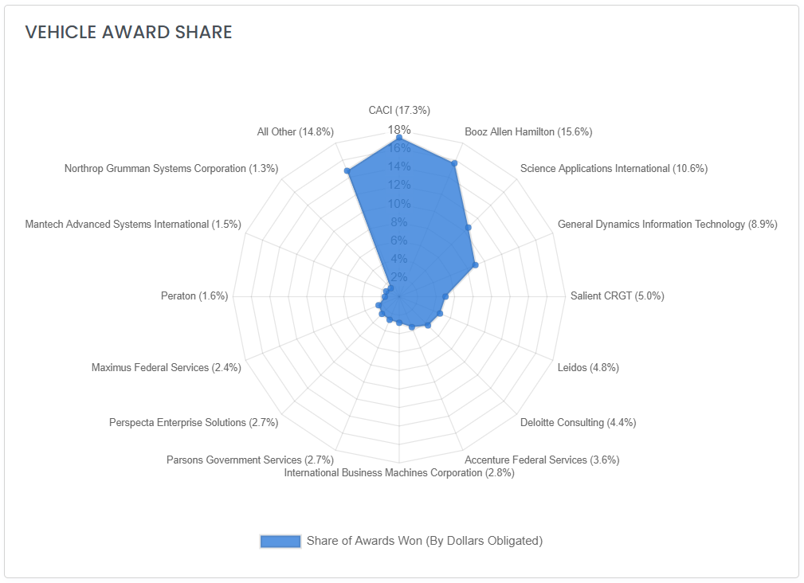

# Analyze Contract Vehicles

## How to Find a Contract Vehicle

There are three primary ways to search for a Vehicle on HigherGov:

1. The Search Bar at the top of every page.  Fastest if you already know the name of the Vehicle.
2. The Vehicle search (Market Intelligence --> Vehicles in the sidebar or [here](https://www.highergov.com/vehicle/)).  Best if you want to filter by Vehicle characteristics such as **Primary Agency**, **Vehicle Type**, **Award Date, End Date,** **Awardee**, etc.
3. The Vehicle Ranking Analysis Tool (go to _Explore --> Analysis_ in the sidebar or click [here](https://www.highergov.com/analysis/award/) (must be signed-in) and then select the Vehicle Rankings tab).  Best if you want to research which Vehicles are most prevalent in any combination of **NAICS**, **PSC**, **Set Aside**, **Agency**, **Contract Type** or any other available search criteria. &#x20;


HigherGov covers more than 4,000 contract vehicles representing the vast majority of multi-award contract vehicles by dollars awarded.  If you are an annual subscriber and need an analysis of a contract vehicle we do not currently cover, please [contact us](mailto:contact@highergov.com) or reach out in the chat.


## Analyze a Contract Vehicle

On the Vehicle detail page, you can see the description of the contract vehicle, the shared ceiling, the primary sponsoring agency, the related contract opportunity, any predecessor or successor vehicle tracked by HigherGov, award and end dates, and the total amounts that have been obligated under the Vehicle.


Note that HigherGov defines the Primary Sponsoring Agency based on the Agency most frequently listed on the contract vehicle awards.  This is not necessarily the agency that will make the most contract awards or the agency that issued the solicitation. &#x20;


The detail page also shows IDV Awards, Contract Awards, and Subcontract Awards under the vehicle.  You can further filter any of the award listings by using the search box above the awards or by clicking the Explore button, which will take you to a search page where you can additional filters.

### Analyze Vehicle Award Share

Each vehicle with awarded contracts will show a spider chart that ranks the largest awardees by dollars obligated.   This chart can be useful in many analyses including determining who is most likely to win a new opportunity under the contract vehicle or a seat on a successor contract vehicle.

Note that you can also analyze vehicle award share for different time periods and see an expanded list by going to the Awardee Rankings of the Funding Analysis below.

### Funding Analysis

The funding analysis tool enbales you to analyze the obligations under the contract Vehicle by:

* **Trends**: Trend in obligations
* **Shares**: Percentage of awards by categories including Agencies, NAICS, PSC, Set Aside, and more
* **Categories**: Historical trends in the largest categories
* **Maps**: The geographic distribution of awards
* **Awardee Rankings**: Rankings of all awardees under the Vehicle that have received awards

### **Explore Awardees**

You can also explore and further filter which awardees hold a position on a contract Vehicle by selecting _Market Intelligence --> Awardees_ in the sidebar or clicking [here](https://www.highergov.com/awardee/)), selecting the **Vehicle** filter, and typing in the name of the Vehicle you would like to analyze. &#x20;

## **Related Pages**


[research-federal-contractors-and-grant-recipients.md](research-federal-contractors-and-grant-recipients.md)



[federal-prime-contracts.md](../find-opportunities/federal-prime-contracts.md)

