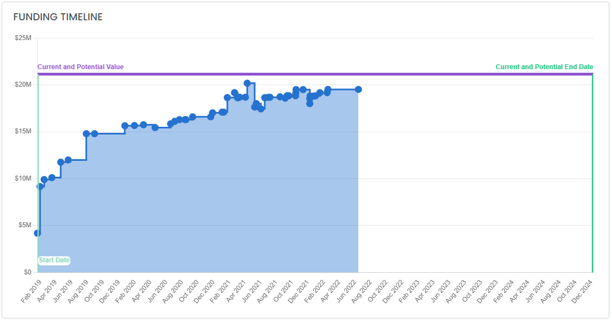

# Find and Analyze Federal Contracts


HigherGov tracks more than 65 million government IDVs, prime contracts, subcontracts, and OTAs awarded since 2000.


## Finding Contracts

### Finding a Specific Contract

If you already know the contract ID of the contract you are looking for, you can enter it into the search bar at the top of the page.&#x20;

### Searching for Contracts

You can search for IDVs, contracts, and subcontracts on the Contract search page by going to _Marketing Intelligence --> Awards --> Contracts_ in the sidebar or by clicking [here](https://www.highergov.com/contract/).  Here you can search by keyword or more than 35 different filters to find contracts including **Agency**, **NAICS**, **PSC**, **Start Date**, **End Date**, **Place of Performance**, **Set Aside**, and more. &#x20;

You can also use the contract search to find potential recompete and subcontract opportunities. &#x20;


[federal-prime-contracts.md](../find-opportunities/federal-prime-contracts.md)



[federal-subcontracts.md](../find-opportunities/federal-subcontracts.md)


If you want to learn more about a contract you click into the detail page to see more detail.

## Contract Detail Analysis

The sections available on the detail page will depend on the type of award and the details of the contract.  The most common sections are below.

* **Overview**: Provides general information about the award including the Awardee, Description, Awarding and Funding Agency, NAICS, PSC, Place of Performance, Pricing Type, Set Aside, and Extent Competed. &#x20;
* **Funding Status **_**(IDV and Contract Only)**_: Provides the total value of the contract and start and end dates.  For IDVs, the amounts obligated and current and potential values represent the sum of all of the contracts awarded under that IDV.
* **Award Hierarchy**: Shows the relationship between this contract and any parent and child awards.

* **Funding Timeline **_**(Contract Only)**_: Graphically shows the history of obligations funded under the contract as well as the start and current and potential end dates.

* **History**: Shows high-level details of any contract modifications (will only appear if the award has had at least one modification)
* **Additional Details **_**(IDV and Contract Only)**_: Provides additional information about the contract including details of competition for the award, any other applicable categorizations, the government's agency categorizations, and any legislative mandates applicable to the contract.

## Finding Additional Information

Sometimes the descriptions provided by the government do not provide much detail on the type of work actually being performed.  Below are resources to find additional information about a contract:

* **Related Opportunity**: Many contract awards have a linked contract opportunity in the Overview section, which can provide additional detail (make sure to check contract opportunity documents and links, which often include a statement of work or additional descriptions).
* **Parent Award**: The descriptions and categories of the parent award(s) (master contract vehicle, IDV, or prime contract as applicable) will often provide additional detail about the general types of work being performed.
* **FOIA Request**: A Freedom of Information Act request can be made to the awarding agency requesting the statement of work.
* **Contracting Officer**: Most IDV and contract pages will list a set of People associated with the contract (and/or the relevant small business office) that you may be able to reach out to obtain additional information about the contract.

## Additional Resources


[find-and-analyze-federal-grants.md](find-and-analyze-federal-grants.md)



[analyze-contract-vehicles.md](analyze-contract-vehicles.md)

