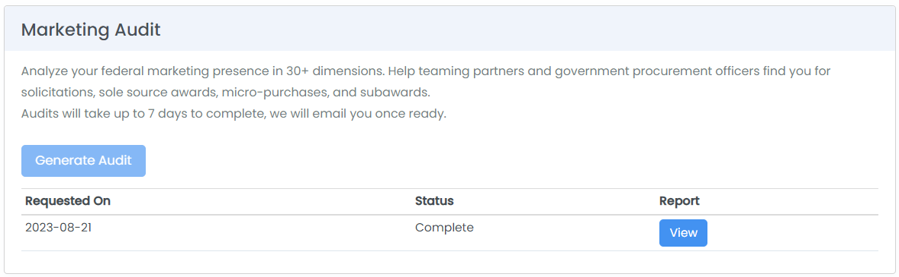

# Promote Your Business

More than 100K contractors and grant recipients, contracting officers, consultants, journalists, and investors use HigherGov every month to find partners, potential vendors, and to perform research. HigherGov offers several tools to help our subscribers promote their organizations on the platform.

## Customize Awardee Profile


Please note that profile customization is only available for companies that have active federal government registrations. &#x20;


Customizing your awardee profile allows you to provide a capability statement and provide a preferred contact and express your teaming goals.  Providing your capability statement also allows your profile to be included in our Capability Statement search in our [Partner Finder](https://www.highergov.com/partner-finder/) tool used by customers to find teaming partners.&#x20;

To customize your Awardee profile, open your [HigherGov Account](https://www.highergov.com/account/), complete the information under the Customize Awardee Profile section, and select Highlight Profile.  Once complete, select Update.

<figure><figcaption></figcaption></figure>

## Marketing Booster


Marketing Booster is only available for Leader plan subscribers &#x20;


### Overview

HigherGov's Marketing Booster allows you to increase the visibility of your company to the broader government market.  Increasing your visibility can help you to find partners, attract talent, and increase your profile in the market.&#x20;

For subscribers that enable the feature, we will track notable contract or grant awards and other developments by your company for potential inclusion in our News and Insights to Lead coverage. You will also have the option of submitting press releases or other notable company developments to HigherGov. &#x20;

Our news and analysis coverage is also often picked up by other government industry and broader news organizations. &#x20;

To turn on Marketing Booster, go to your [Account](https://www.highergov.com/account/) page and select the toggle in the Marketing Booster section.

<figure><figcaption></figcaption></figure>

Within a couple days of turning on the Marketing Booster, you can click on the **See Statistics** button to see the total number of views your organization has had in its Awardee profile, in the Partner Finder, and in News and Insights.  Note that it may take a few days for the marketing statistics to populate (it will likely take longer for any reports to appear)&#x20;

<figure><figcaption></figcaption></figure>

### News and Notable Events

Typical organization news and events that may be covered:

* Large or notable contract or grant wins
* Executive moves
* Notable technology or product releases
* Mergers or acquisitions

**Please note that HigherGov maintains editorial control over all content and does not guarantee the inclusion of any one news event or any total number of events in a given year.** &#x20;

### Consulting and Advisory Companies

If your organization does not directly win government contracts or grants that would typically be covered, you may alternatively submit research or thought leadership for potential inclusion in our Insights to Lead. &#x20;

To be included, submissions must be of high quality, provide original research or insights, and have minimal promotional language. &#x20;

HigherGov reserves the right to accept or reject submissions at its own discretion.
