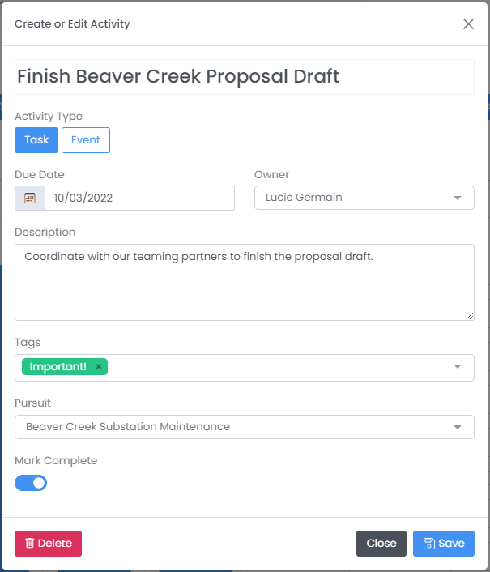

# Add Pursuits to Pipeline


Before creating pursuits, you must first [create a pipeline](create-a-pipeline.md).


## Finding and Adding Pursuits

### Find Opportunities

HigherGov has many tools to help to identify potential opportunities.  See one of the below topics for more details on some of the available tools.


[federal-prime-contracts.md](../find-opportunities/federal-prime-contracts.md)



[federal-subcontracts.md](../find-opportunities/federal-subcontracts.md)



[federal-grants-and-subgrants.md](../find-opportunities/federal-grants-and-subgrants.md)



[state-and-local-contracts.md](../find-opportunities/state-and-local-contracts.md)


### Adding Automatically

You can automatically create new pursuits from Federal and State and Local Contract Opportunity, Forecast Opportunity, DIBBS Opportunity, Grant Opportunity, SBIR Opportunity, IDV Award, Prime Contract Award, and Prime Grant Award pages by selecting the Pipeline dropdown in the upper right of the page and selecting the pipeline you want to add the opportunity to.  This will create a new pursuit and autofill any available information from the opportunity or award.

Once you have created a pursuit automatically you can further edit the pursuit by going to _Business Development --> Pursuits_ (or clicking [here](https://www.highergov.com/pursuit/)) and selecting the pursuit you created.

### Adding Pursuit Manually

You can manually create a new pursuit by selecting _Business Development --> Pursuits --> \[+]_ on the sidebar or clicking [here](https://www.highergov.com/pursuit/new).  On this screen you can enter basic pursuit information, add links to other relevant data in HigherGov, upload documents, talk with your team members, and create activities for yourself and others.

Once you have added some information about the Pursuit and saved, the Bidders and Similar tabs will populate, providing you additional insights about potential bidders as well as similar active opportunities. The more completely the pursuit information is filled out, the more accurate and useful the insights these tabs provide will be.

## Managing Pursuits

### Editing Pursuit Details

Once you have created a pursuit, you can edit it by opening it from the [Pursuit](https://www.highergov.com/pursuit/) search page, making any changes, and saving. &#x20;

Alternatively, you can also filter and edit key pursuit information in bulk by selecting _Business Development --> Pipelines_ in the sidebar and clicking on the Pursuit tab.  On this tab, you can filter the displayed information by **Pipeline** or **Owner** by using the dropdowns at top and further filter by **Stage** as well as pursuits **Past Due**, **Due Soon**, and **Stale** (not updated recently).  Key pursuit information including Proposal Date, Pursuit Stage, p(win), p(go), and Estimated Value can be quickly updated from this page or you can open the pursuit to edit other information.

### Managing Activities

You can further manage pursuits by adding Activities, including activities and events, for yourself and others. You can create a new Activity by selecting _Business Development --> Activities --> \[+]_ from the sidebar anywhere in HigherGov or within a pursuit by going to the Activities tab and selecting the \[+New] button.&#x20;

For each activity, you can add a Title, Activity Type, Due Date, Owner, Description, Tags, and assign the Activity to any Pursuit.  You can view all of your team's activities by going to activity search under _Business Development --> Activities_ in the sidebar or reviewing the calendars on your Dashboard or on the Pipeline Review page.  From these pages you can also edit Activities at any time.

