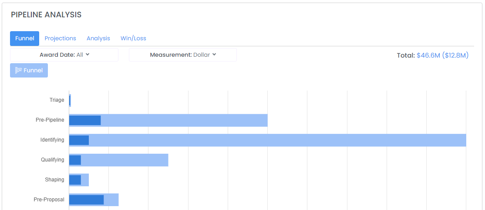
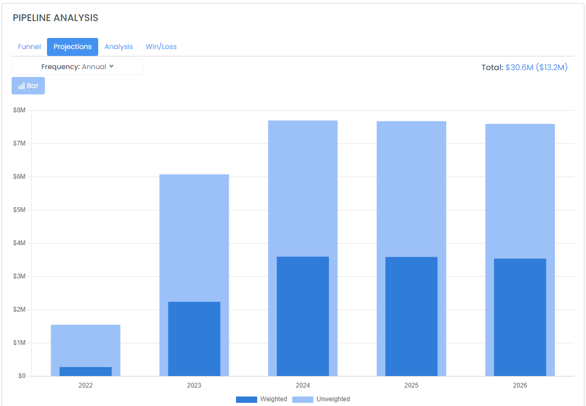
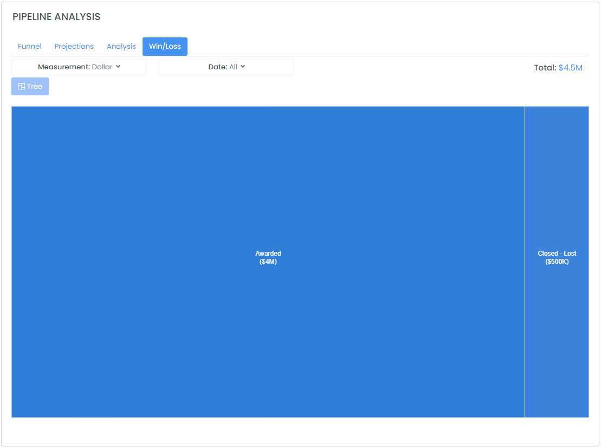

# Review Pipeline and Performance

## Pipeline Analysis

To start an analysis of your pipeline(s), select Business _Development --> Pipelines_ in the sidebar or click [here](https://www.highergov.com/pipeline/).  Along the top of the page, you can filter the analysis by Pipeline and Pursuit owner, which allows you to better understand the performance of teams or individual team members. &#x20;


Note that you must first have created a pipeline before being able to access the pipeline analysis page.


### Funnel

Shows the weighted and unweighted value of your pipeline by stage.  You can filter the funnel to show different calendar years and can change the measurement to show the pipeline by dollar or by number of opportunities. &#x20;

Note that if you have more than one Pipeline selected the funnel will show the pipeline stages relative to Award (-1 meaning one stage from Award, -2 meaning two stages from Award) rather than by name.&#x20;

### Projections

Shows the weighted and unweighted value of the pipeline by Year, Quarter, or Month.

### Analysis

Shows a breakdown of the funnel by different categories including **Agency**, **Contract/Grant**, **Contract Vehicle**, **Owner**, **Pursuit Type**, **NAICS**, **Prime/Sub**, **PSC**, and **Set Aside**.  The analysis can be further filtered by **Weighted** and **Unweighted** pipeline and **Dollar** vs **Count**.

### Win/Loss

Shows opportunity Win / Loss rates and can be analyzed by dollar and count and by calendar year.

### Calendar

The Calendar tab shows all historical and upcoming pursuits and activities for the selected Pipelines / Owners.  This calendar is also available from your Dashboard when you sign in.

### Bulk Pursuit Editor

Need to make adjustments quickly?  The Pursuits tab in the Pipeline Review allows for rapidly changing proposal due date, pursuit stage, p(win), p(go), and estimated value for multiple pursuits quickly.  The Pipeline Analysis will be automatically updated after adjustments are made.

## Related Pages


[find-federal-prime-contract-opportunities.md](../find-opportunities/find-federal-prime-contract-opportunities.md)



[find-federal-grant-and-subgrant-opportunities.md](../find-opportunities/find-federal-grant-and-subgrant-opportunities.md)

